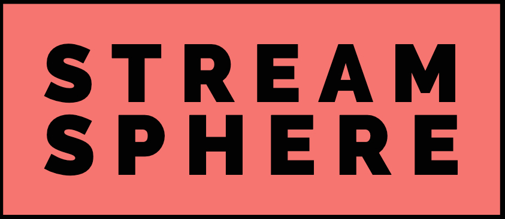

<h1 align="center">
  <br>
  
  <br>
  Welcome to Stream Sphere 👋
  <br>
</h1>
<h4 align="center">A web application built using Node JS with Socket.IO that allows you to play virtual charades with your friends using a drawing canvas.</h4>

<p align="center">
  <a href="#introduction">Introduction</a> •
  <a href="#application-in-action">Application in Action</a> •
  <a href="#installation">Installation</a> •
  <a href="#application-structure">Application Structure</a> •
  <a href="#key-features">Key Features</a> •
  <a href="#how-to-use">How To Use</a> •
  <a href="#credits">Credits</a> •
  <a href="#author">Author</a>
</p>

## Introduction

Welcome to Art Arena, this is an application that allows you to play virtual charades online with your friends. One person get to create a room by selecting their avatar and background. After creation of the room, there will be a link generated, the creater can share the link to their friends and wait for them to join. Anyone with the link can join. Once all the members joined, the creator is the only person allowed to start and do the respective setup of the game like custom words, language selection, probablity, rounds and duration per question.

Once the game starts, the creator will be the first one to go, he/she must select a  word of three given by the application. And they can to draw using different colors, erase them etc. Respectively other's have to guess the word in the chatbox, anyone can see any text, except for the correct answer. Also the application assist by measuring the distance of the correctness of answer. Once guessed correct, your points will be increased. After the respective number of rounds the scorecard of who won will be generated. This game is  inspired in the Covid period lockdown to still interact and have fun with friends virtually.

## Application in Action


## Installation

Install with NPM:

```
Make sure Node JS is installed

> npm install
```

## Application Structure

```
.
└── Art Arena/
    ├── controllers/
    │   ├── Canvas.js
    │   ├── Disconnect.js
    │   ├── Game.js
    │   ├── helpers.js
    │   └── Rooms.js
    ├── node_modules
    ├── public/
    │   ├── css/
    │   │   └── index.css
    │   ├── images
    │   └── js/
    │       ├── avatar.js
    │       ├── canvas.js
    │       ├── game.js
    │       ├── settings.js
    │       └── transliterate.js
    ├── views/
    │   ├── partials/
    │   │   ├── game-end.ejs
    │   │   ├── game.ejs
    │   │   ├── landing.ejs
    │   │   ├── settings.js
    │   │   └── tools.ejs
    │   └── index.ejs
    ├── .gitignore
    ├── app.js
    ├── config.js
    ├── package-lock.json
    ├── package.json
    ├── README.md
    ├── sockets.js
    └── words.json
```

## Key Features

⭐️ Draw in Canvas - Allows you to draw in a canvas and immediately let others view the broadcasting.

⭐️ Words distance measure - Calculates the distance and let you know how close you're to the guessing game.

⭐️ Customize Avatar - Choose who you wanna be with your backgorund color.

⭐️ Set Language, words & probablity - Choose the language and if needed custom words you want the application to suggest with the probablity of it occuring.

⭐️ Translate Text - In the chatbox, it shows you translated suggested words for non-native english speakers.

## How To Use

To clone and run this application, you'll need [Git](https://git-scm.com) and [Node JS](https://nodejs.org/).

From your command line:

```bash
Make sure Node JS is installed

# Clone the application
> git clone https://github.com/N-liraj-khanna/Art-Arena.git

# Enter into the directory
> cd Art-Arena

# Install the necessary packages
> npm install

# Enjoy the application
> npm start
```
The application will be running in http://localhost:3000/.

## Credits

This software uses the following open source packages:

- [Node JS](https://nodejs.org/)
- [Socket.IO](https://socket.io)
- [EJS](https://www.ejs.co/)
- [Express](https://www.expressjs.com/)
- [Bootsrap](https://www.getbootstrap.com/)
- [Javascript](https://www.javascript.com/)


## Author


👤 **N Liraj Khanna**

* Website: https://github.com/N-liraj-khanna
* Github: [@N-liraj-khanna](https://github.com/N-liraj-khanna)
* LinkedIn: [@https://www.linkedin.com/in/n-lirajkhanna/](https://www.linkedin.com/in/n-lirajkhanna/)

## 🤝 Contributing

Contributions, issues and feature requests are welcome!<br />

## Show your support

Give a ⭐️ if this project helped you!

## 📝 License


MIT

---


> Copyright © 2023 [@N-liraj-khanna](https://github.com/N-liraj-khanna) &nbsp;&middot;&nbsp;

